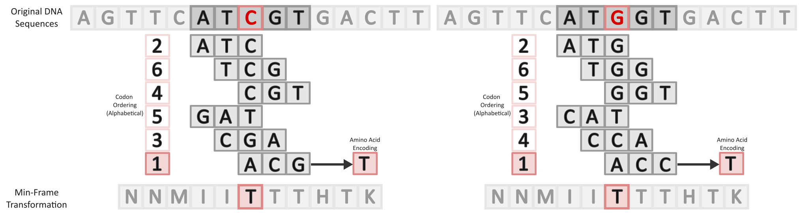

# Min-Frame Transformation (MFT)

This code base contains utility functions and analyses for the Min-Frame Transformation (MFT) collectively called mft-tools. 

## Overview of Min-Frame Transformation
The MFT allows local transformation of a nucleotide sequence to a character sequence over a separate defined alphabet. This transformation allows effectively masks a large percentage of single-nucleotide mutations and can lead to increased sensitivity when using full-text indexing methods (MUMs, BWT, etc). Downstream this can lead to better accuracy and performance on genome alignment tasks, and potentially more. 



The MFT is similar to the use of minimizers in many ways, however there are some key differences:
1. A value is chosen for every single window, even if it is the same as the neighboring window. This allows for a 1:1 transformation in sequence length
2. The ordering of the kmers is not random and must be defined a-priori
3. Kmers map directly to a reduced alphabet (typically 12-64 characters), rather than a single hash per kmer. This allows for mutations to be masked

## Installation

mft-tools is currently distributed as source only. You will need [Rust](https://www.rust-lang.org/tools/install) (edition 2024, stable toolchain) installed.

```bash
# 1. Clone the repository
git clone https://github.com/treangenlab/mft-tools.git
cd mft-tools

# 2. Build and run (release build recommended for performance)
cargo build --release

# The compiled binary will be at ./target/release/mft-tools
# You can also run directly with cargo:
cargo run --release -- --help
```

## Usage

mft-tools exposes five subcommands. The typical workflow is:

1. **`define-mapping`** — generate a k-mer → character mapping table
2. **`define-order`** — generate a starting k-mer ordering (random or alphabetical)
3. **`optimize`** — find an ordering of k-mers that maximises the masking rate
4. **`evaluate`** — compute the theoretical SNP masking rate for a given mapping + ordering pair
5. **`transform`** — apply the transformation to one or more FASTA files

Steps 2 and 3 are optional: `transform` will generate a random ordering on the fly if none is provided, and `optimize` can also start from a random ordering. `evaluate` can be used after any step that produces an ordering to inspect its masking properties before committing to a full transformation.

Pre-built mapping tables for common configurations are provided in the [`mapping_tables/`](mapping_tables/) directory.

---

### `define-mapping`

Generates a tab-delimited mapping table that assigns every k-mer to a character in a reduced alphabet. The reduced alphabet is derived from a spaced-seed pattern: positions marked `1` or `X` in the seed are the "match" positions, so k-mers that agree at those positions map to the same character.

```
mft-tools define-mapping [OPTIONS] --kmer-size <K> --output <FILE>
                             (--alphabet-size <N> | --spaced-seed <SEED>)
```

| Flag | Default | Description |
|------|---------|-------------|
| `-k, --kmer-size` | *(required)* | k-mer length (3–15) |
| `-a, --alphabet-size` | — | Size of reduced alphabet (mutually exclusive with `--spaced-seed`) |
| `-s, --spaced-seed` | — | Seed pattern, e.g. `11011` (length must equal k; weight 2–3) |
| `-o, --output` | *(required)* | Output file path |
| `--verbose` | off | Verbose logging |

**Example** — build a mapping table for k=5 with seed `11011` (ignore the middle position):

```bash
mft-tools define-mapping -k 5 -s 11011 -o mapping_tables/k5_11011.txt
```

**Output** — a tab-delimited file with one k-mer per line followed by its mapped character:

```
AAAAA   A
AAAAC   A
AAAAG   A
...
TTTTT   L
```

The file will contain `4^k` lines (one per k-mer). The number of distinct characters equals the number of unique patterns defined by the seed (e.g. `4^weight` for a spaced seed of a given weight).

---

### `define-order`

Generates a plain-text k-mer ordering file to use as input to `optimize` or `transform`. Two ordering strategies are available: random (default) and alphabetical. If neither `--seed` nor `--alphabetical` is given, a seed is drawn from OS entropy and printed to stderr so the run is reproducible.

```
mft-tools define-order [OPTIONS]
```

| Flag | Default | Description |
|------|---------|-------------|
| `-k, --kmer-size` | `3` | k-mer length (3–15) |
| `-s, --seed` | — | Seed for random ordering (mutually exclusive with `-a`) |
| `-a, --alphabetical` | off | Use alphabetical (ACGT) ordering instead of random (mutually exclusive with `-s`) |
| `-o, --output` | `order.txt` | Output ordering file |
| `--verbose` | off | Verbose logging |

**Example** — random ordering with a fixed seed:

```bash
mft-tools define-order -k 3 -s 42 -o order_seed42.txt
```

**Example** — random ordering with an auto-generated seed (seed is printed to stderr):

```bash
mft-tools define-order -k 3 -o order_random.txt
# [INFO] No seed provided. Using randomly generated seed: 13278540921643
```

**Example** — alphabetical ordering:

```bash
mft-tools define-order -k 3 -a -o order_alpha.txt
```

**Output** — a plain-text file with one k-mer per line, listed in priority order (rank 0 first). The file contains all `4^k` k-mers (64 lines for k=3):

```
CTG
TTG
CTC
...
```

---

### `optimize`

Runs a hill-climbing search over k-mer orderings to maximise the MFT masking rate — the fraction of single-nucleotide mutations that do not change the transformed character at that position. The result is an ordering file used as input to the `mft` subcommand.

```
mft-tools optimize [OPTIONS] --mapping-table <FILE>
```

| Flag | Default | Description |
|------|---------|-------------|
| `-k, --kmer-size` | `3` | k-mer length (must match mapping table) |
| `-w, --window-size` | `5` | Sliding window length (must be > k) |
| `-m, --mapping-table` | *(required)* | Path to tab-delimited mapping file |
| `-b, --base-order` | random | Initial ordering file to seed optimisation from |
| `-i, --iterations` | `4000` | Number of hill-climbing iterations (max 10 000) |
| `-s, --samples` | `10000` | Windows sampled per masking-rate evaluation |
| `-o, --output` | `optimized_order.txt` | Output ordering file |
| `--verbose` | off | Verbose logging |

**Example** — optimise an ordering for k=3, w=5 using the provided mapping table:

```bash
mft-tools optimize -k 3 -w 5 -m mapping_tables/k3_XX-.txt -i 4000 -o optimized_order.txt
```

**Progress output** (stderr) — each improvement is logged:

```
[INFO] Starting hill-climbing optimization
[INFO] Parameters: k=3, w=5, iterations=4000
[INFO] Initial Masking Rate: 72.3100%
[INFO]  Trial   47: Improvement -- New Masking Rate: 72.4800% (+0.1700%) -- New Entropy: 3.58
[INFO]  Trial  213: Improvement -- New Masking Rate: 72.6300% (+0.1500%) -- New Entropy: 3.61
...
[INFO] Optimized ordering saved to optimized_order.txt
```

**Output file** — a plain-text file with one k-mer per line, listed in priority order (rank 0 first):

```
CTG
TTG
CTC
...
```

The file contains all `4^k` k-mers (64 lines for k=3).

---

### `evaluate`

Computes the theoretical SNP masking rate for a given mapping table and k-mer ordering without running a full transformation. For each sampled window, every possible single-nucleotide mutation is tested and the fraction that leave the transformed character unchanged is reported — both globally and broken down by the 12 substitution types. The entropy of the transformed character distribution is also reported as a measure of alphabet utilisation.

```
mft-tools evaluate [OPTIONS] --mapping-table <FILE> --ordering <FILE>
```

| Flag | Default | Description |
|------|---------|-------------|
| `-k, --kmer-size` | `3` | k-mer length (must match mapping table and ordering) |
| `-w, --window-size` | `5` | Sliding window length (must be > k) |
| `-m, --mapping-table` | *(required)* | Path to tab-delimited mapping file |
| `-b, --ordering` | *(required)* | Path to k-mer ordering file |
| `-n, --n-samples` | `10000` | Number of windows to sample for the masking rate calculation |
| `-o, --output` | `evaluation.txt` | Output file path |
| `--verbose` | off | Verbose logging |

**Example** — evaluate an optimised ordering:

```bash
mft-tools evaluate -k 3 -w 5 \
    -m mapping_tables/k3_XX-.txt \
    -b optimized_order.txt \
    -o evaluation.txt
```

**Output** — a tab-delimited file with one metric per line. The global rate and entropy are listed first, followed by the 12 substitution-type rates in alphabetical order:

```
global_masking_rate	0.456771
entropy	3.661167
A->C	0.355469
A->G	0.379687
A->T	0.322656
C->A	0.355469
C->G	0.482031
C->T	0.589063
G->A	0.379687
G->C	0.482031
G->T	0.611719
T->A	0.322656
T->C	0.589063
T->G	0.611719
```

The global masking rate is the fraction of all tested SNPs that did not change the transformed character. Values closer to `1.0` indicate stronger mutation masking. The per-substitution rates highlight which transition types (e.g. transitions vs transversions) are masked more effectively by a given ordering.

---

### `transform`

Applies the Min-Frame Transformation to one or more FASTA files. Each sequence is transformed to a same-length string over the reduced alphabet and written to a new FASTA file.

```
mft-tools transform [OPTIONS] --genomes <FILE>... --mapping-table <FILE>
```

| Flag | Default | Description |
|------|---------|-------------|
| `-g, --genomes` | *(required)* | One or more input FASTA files (`.fa`, `.fasta`, `.fna`, optionally `.gz`) |
| `-k, --kmer-size` | `3` | k-mer length (must match mapping table and order file) |
| `-w, --window-size` | `5` | Sliding window length (must be > k) |
| `-m, --mapping-table` | *(required)* | Path to tab-delimited mapping file |
| `-b, --order` | random | Path to k-mer ordering file; if omitted a random ordering is generated |
| `-s, --seed` | — | Seed for the random ordering (used only when `-b` is omitted; printed to stderr if not set) |
| `-o, --output` | `mft.fa` | Output FASTA file path |
| `--verbose` | off | Verbose logging |

**Example** — transform a genome FASTA file:

```bash
mft-tools transform -g genome.fna -k 3 -w 5 \
        -m mapping_tables/k3_XX-.txt \
        -b optimized_order.txt \
        -o genome_mft.fa
```

Multiple input files can be provided; all sequences are written to the single output file:

```bash
mft-tools transform -g ref.fa query.fa -k 3 -w 5 \
        -m mapping_tables/k3_XX-.txt \
        -b optimized_order.txt \
        -o combined_mft.fa
```

**Output** — a FASTA file where each record preserves the original header and has a transformed sequence of the same length (number of k-mers = sequence length − k + 1):

```
>U00096.3 Escherichia coli str. K-12 substr. MG1655, complete genome
LLLFSHHHSLLL_LLLAATRRRAAAQYMMMSLLLLLCCCVDDLLL_KKKK...
```

A progress line is emitted to stderr for each sequence processed:

```
[INFO] Transformed 'U00096.3'. Length: 4641649
```
